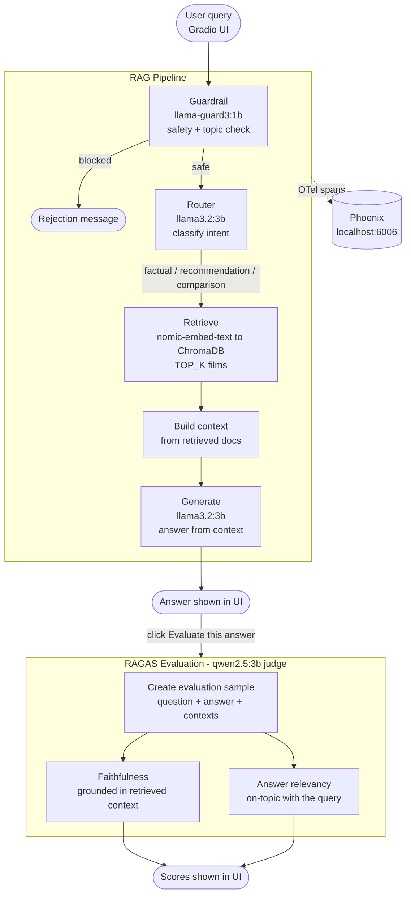

# RAG Film Chatbot

A fully local RAG chatbot for film recommendations built with Ollama, ChromaDB, Phoenix, and RAGAS.

## Full pipeline - from client to RAGAS



## Requirements

- Python 3.11+
- Ollama installed and running
- Docker Desktop, if you want Phoenix tracing

> 🪟 **Windows only:** use **Python 3.11** (not 3.12/3.13). `chromadb` ships pre-built wheels only for 3.11 on Windows — newer versions will fail to install with a C++ compiler error.

## Setup

### 1. Enter the project folder

```bash
cd local-rag-film-chatbot
```

### 2. Create and activate a virtual environment

🐧 **Linux / macOS**
```bash
python3 -m venv .venv
source .venv/bin/activate
```

🪟 **Windows (PowerShell)**
```powershell
python -m venv .venv
.venv\Scripts\Activate.ps1
```

> If PowerShell blocks the script with an execution-policy error, run once:
> `Set-ExecutionPolicy -ExecutionPolicy RemoteSigned -Scope CurrentUser`

🪟 **Windows (Command Prompt)**
```cmd
python -m venv .venv
.venv\Scripts\activate.bat
```

### 3. Install dependencies

🐧 **Linux / macOS**
```bash
.venv/bin/python -m pip install -r requirements.txt
```

🪟 **Windows**
```powershell
.venv\Scripts\python -m pip install -r requirements.txt
```

### 4. Optional: customize configuration

Configuration is read from environment variables, with defaults defined in `src/config.py`.

### 5. Start Ollama

```bash
ollama serve
```

### 6. Pull the Ollama models

```bash
ollama pull nomic-embed-text
ollama pull llama3.2:3b
ollama pull llama-guard3:1b
ollama pull qwen2.5:3b
```

### 7. Index the dataset into ChromaDB (one-time only)

The TMDB dataset is already included in `data/`. This step only needs to be run once — it populates the local ChromaDB database. Skip it if `chroma_db/` already exists.

🐧 **Linux / macOS**
```bash
.venv/bin/python ingest.py
```

🪟 **Windows**
```powershell
.venv\Scripts\python ingest.py
```

### 8. Run the chatbot

🐧 **Linux / macOS**
```bash
.venv/bin/python chatbot.py
```

🪟 **Windows**
```powershell
.venv\Scripts\python chatbot.py
```

Open `http://127.0.0.1:7860`.

## Local quality gate — optional (contributors only)

> This section is intended for contributors who want to run automated checks before each commit. End users running the chatbot can skip this entirely.

Install the git hook once:

🐧 **Linux / macOS**
```bash
.venv/bin/python -m pre_commit install
```

🪟 **Windows**
```powershell
.venv\Scripts\python -m pre_commit install
```

From that point on, every `git commit` runs `pytest` first through `scripts/run-tests.sh`.

You can also run the same checks manually:

🐧 **Linux / macOS**
```bash
.venv/bin/python -m pre_commit run --all-files
```

🪟 **Windows**
```powershell
.venv\Scripts\python -m pre_commit run --all-files
```

## Observability with Phoenix

This section assumes Docker is already installed on the user's machine.

Phoenix runs in Docker; the Python app sends traces with the OTLP HTTP exporter to `http://localhost:6006/v1/traces`.

If you want to avoid Docker overhead on the laptop, a practical alternative is Phoenix Cloud. Arize documents free Phoenix Cloud instances with 10 GiB of storage. In that setup you would point tracing to your Phoenix Cloud HTTP endpoint instead of `localhost`.

### 1. Start Phoenix

```bash
docker run -p 6006:6006 -p 4317:4317 arizephoenix/phoenix:latest
```

### 2. Start the chatbot

🐧 **Linux / macOS**
```bash
.venv/bin/python chatbot.py
```

🪟 **Windows**
```powershell
.venv\Scripts\python chatbot.py
```

### 3. Open Phoenix

- Projects: `http://localhost:6006/projects`
- Traces appear under the `rag-film-chatbot` tracer after each query

## Project structure

```text
local-rag-film-chatbot/
├── chatbot.py
├── data/
├── evaluate.py
├── ingest.py
├── scripts/
│   └── run-tests.sh
├── src/
│   ├── __init__.py
│   ├── chatbot.py
│   ├── config.py
│   ├── evaluate.py
│   ├── guardrail.py
│   ├── ingest.py
│   ├── rag_pipeline.py
│   ├── router.py
│   └── tracing.py
├── .gitignore
├── .pre-commit-config.yaml
└── requirements.txt
```

## Environment variables

These values can be overridden before running the app.

🐧 **Linux / macOS**
```bash
export OLLAMA_BASE_URL=http://localhost:11434
export GUARDRAIL_ENABLED=true
export LLM_MODEL=llama3.2:3b
export EMBED_MODEL=nomic-embed-text
export JUDGE_MODEL=qwen2.5:3b
export GUARD_MODEL=llama-guard3:1b
export CHROMA_PATH=./chroma_db
export CHROMA_COLLECTION=films
export TOP_K=5
```

🪟 **Windows (PowerShell)**
```powershell
$env:OLLAMA_BASE_URL="http://localhost:11434"
$env:GUARDRAIL_ENABLED="true"
$env:LLM_MODEL="llama3.2:3b"
$env:EMBED_MODEL="nomic-embed-text"
$env:JUDGE_MODEL="qwen2.5:3b"
$env:GUARD_MODEL="llama-guard3:1b"
$env:CHROMA_PATH="./chroma_db"
$env:CHROMA_COLLECTION="films"
$env:TOP_K="5"
```

🪟 **Windows (Command Prompt)**
```cmd
set OLLAMA_BASE_URL=http://localhost:11434
set GUARDRAIL_ENABLED=true
set LLM_MODEL=llama3.2:3b
set EMBED_MODEL=nomic-embed-text
set JUDGE_MODEL=qwen2.5:3b
set GUARD_MODEL=llama-guard3:1b
set CHROMA_PATH=./chroma_db
set CHROMA_COLLECTION=films
set TOP_K=5
```
