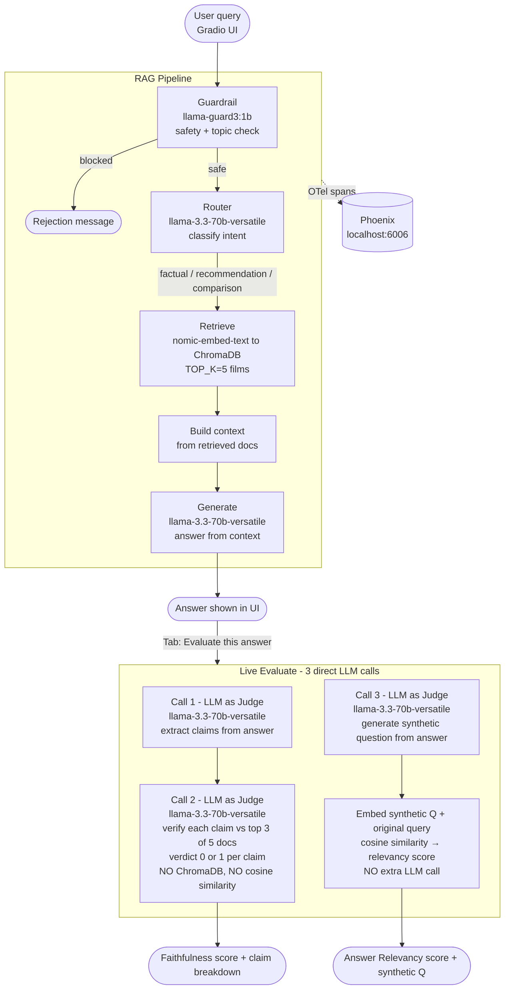
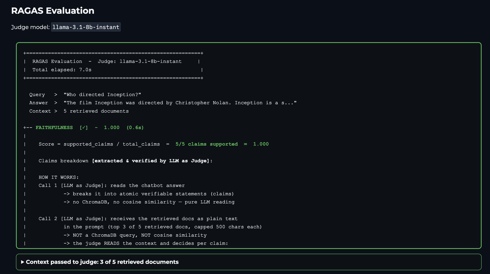

# RAG Film Chatbot

<p align="center">
  <a href="https://giovannitammaro-cinerag.hf.space/">
    
  </a>
</p>

A fully local RAG chatbot for film recommendations built with Ollama, ChromaDB, Phoenix, and RAGAS.

## Tech Stack

| Layer | Tool |
|---|---|
| LLM inference | [Groq](https://groq.com) (cloud) / [Ollama](https://ollama.com) (local) |
| Vector store | [ChromaDB](https://www.trychroma.com) |
| Embeddings | nomic-embed-text / sentence-transformers |
| Evaluation | [RAGAS](https://docs.ragas.io) |
| Observability | [Phoenix by Arize](https://phoenix.arize.com) (OpenTelemetry) |
| UI | [Gradio](https://gradio.app) |
| Dataset | TMDB 5000 movies |

## Full pipeline - from client to evaluation



- [1A. Answer](#1a-answer)
- [1B. RAG evaluation](#1b-rag-evaluation)

## Requirements

- Python 3.11+
- Ollama installed and running
- Docker Desktop, if you want Phoenix tracing

> **Windows only:** use **Python 3.11** (not 3.12/3.13). `chromadb` ships pre-built wheels only for 3.11 on Windows - newer versions will fail to install with a C++ compiler error.

## Setup

### 1. Enter the project folder

```bash
cd local-rag-film-chatbot
```

### 2. Create and activate a virtual environment

**Linux / macOS**
```bash
python3 -m venv .venv
source .venv/bin/activate
```

**Windows (PowerShell)**
```powershell
python -m venv .venv
.venv\Scripts\Activate.ps1
```

> If PowerShell blocks the script with an execution-policy error, run once:
> `Set-ExecutionPolicy -ExecutionPolicy RemoteSigned -Scope CurrentUser`

**Windows (Command Prompt)**
```cmd
python -m venv .venv
.venv\Scripts\activate.bat
```

### 3. Install dependencies

**Linux / macOS**
```bash
.venv/bin/python -m pip install -r requirements.txt
```

**Windows**
```powershell
.venv\Scripts\python -m pip install -r requirements.txt
```

### 4. Start Ollama

```bash
ollama serve
```

### 5. Pull the Ollama models

```bash
ollama pull nomic-embed-text
ollama pull llama3.2:3b
ollama pull llama-guard3:1b
ollama pull qwen2.5:3b
```

### 6. Index the dataset into ChromaDB (one-time only)

The TMDB dataset is already included in `data/`. Skip this step if `chroma_db/` already exists.

**Linux / macOS**
```bash
.venv/bin/python ingest.py
```

**Windows**
```powershell
.venv\Scripts\python ingest.py
```

### 7. Run the chatbot

**Linux / macOS**
```bash
.venv/bin/python chatbot.py
```

**Windows**
```powershell
.venv\Scripts\python chatbot.py
```

Open `http://127.0.0.1:7860`.

## Observability with Phoenix

Phoenix runs in Docker and receives OpenTelemetry traces from the app.

### 1. Start Phoenix

```bash
docker run -p 6006:6006 -p 4317:4317 arizephoenix/phoenix:latest
```

### 2. Start the chatbot

```bash
.venv/bin/python chatbot.py
```

### 3. Open Phoenix

- Projects: `http://localhost:6006/projects`
- Traces appear under the `cinerag` project after each query

## Project structure

```text
cinerag/
├── chatbot.py              # entry point - runs src/chatbot.py
├── ingest.py               # entry point - runs src/ingest.py
├── evaluate.py             # entry point - runs src/evaluate.py
├── requirements.txt
├── pytest.ini
├── .gitignore
│
├── data/
│   ├── tmdb_5000_movies.csv
│   └── tmdb_5000_credits.csv
│
├── images/                 # screenshots used in this README
│
├── scripts/
│   └── run-tests.sh
│
├── src/
│   ├── config.py           # model names, paths, env vars
│   ├── tracing.py          # OpenTelemetry + Phoenix init
│   ├── guardrail.py        # Llama Guard 3 safety + topic filter
│   ├── router.py           # LLM-based intent classifier
│   ├── rag_pipeline.py     # retrieve + generate pipeline
│   ├── evaluate.py         # RAGAS evaluation logic
│   └── chatbot.py          # Gradio UI (Chat + Evaluate tabs)
│
└── tests/
    ├── test_config.py
    ├── test_rag_pipeline.py
    └── test_router.py
```

## Environment variables

All values have defaults in `src/config.py` and can be overridden before running.

**Linux / macOS**
```bash
export OLLAMA_BASE_URL=http://localhost:11434
export GUARDRAIL_ENABLED=true
export LLM_MODEL=llama3.2:3b
export EMBED_MODEL=nomic-embed-text
export JUDGE_MODEL=qwen2.5:3b
export GUARD_MODEL=llama-guard3:1b
export CHROMA_PATH=./chroma_db
export CHROMA_COLLECTION=films
export TOP_K=5
```

**Windows (PowerShell)**
```powershell
$env:OLLAMA_BASE_URL="http://localhost:11434"
$env:GUARDRAIL_ENABLED="true"
$env:LLM_MODEL="llama3.2:3b"
$env:EMBED_MODEL="nomic-embed-text"
$env:JUDGE_MODEL="qwen2.5:3b"
$env:GUARD_MODEL="llama-guard3:1b"
$env:CHROMA_PATH="./chroma_db"
$env:CHROMA_COLLECTION="films"
$env:TOP_K="5"
```

---

## UI tabs

The app has two tabs:

| Tab | What it does |
|---|---|
| **Chat** | Ask questions, get answers from the RAG pipeline |
| **Evaluate** | Score the last chat answer with 3 direct LLM calls (faithfulness + answer relevancy) |

### Why this evaluation approach?

The **Evaluate** tab uses direct OpenAI calls (no RAGAS library) to compute the same metrics faster and show the full breakdown — claims, verdicts, and the synthetic question — without extra API calls.

---

## Answer, inference and evaluation

### 1A. Answer


The `Answer` is the final response returned to the user in the chatbot UI.
It is produced after the RAG pipeline has accepted the question, retrieved the
most relevant film documents from ChromaDB, built the context, and asked the LLM
to generate a grounded answer from that context.

### 1B. RAG evaluation



The `RAG evaluation` view scores the last generated answer and shows the judge,
the retrieved context, the claim checks, and the final metric values.

### 2. Inference trace


Phoenix records the inference flow as a trace. A typical query starts from
`cinerag.query`, then enters the RAG pipeline through `rag.run`.
Inside that run, the application retrieves context with `rag.retrieve` and
then generates the final answer with `rag.generate`.

- `cinerag.query`: the parent trace for the whole user request
- first `ChatCompletion`: the router/classifier LLM call - classifies intent as `factual`, `recommendation`, or `comparison`
- `rag.run`: the main RAG pipeline container
- `rag.retrieve`: searches ChromaDB for the most relevant film documents
- `rag.generate` + nested `ChatCompletion`: builds the prompt from question + context, then calls the LLM

### 3. LLM calls breakdown


Clicking **Evaluate this answer** scores the last answer using 3 direct LLM calls to the judge model (`llama-3.3-70b-versatile` on Groq):

```
faithfulness      -> 2 LLM calls   (call 1: claim extraction, call 2: claim verification)
answer relevancy  -> 1 LLM call    (generate synthetic question) + cosine similarity
-------------------------------------------------
total              -> 3 LLM calls
```

Context passed to the judge is trimmed: top 3 of 5 retrieved documents, each capped at 500 characters. This halves the token count, reducing latency and rate-limit pressure on the Groq free tier.

**Faithfulness - did the chatbot stick to what it retrieved?**

- **Call 1 [LLM as Judge]**: reads the chatbot answer, extracts every atomic verifiable claim as a list. No ChromaDB query, no cosine similarity — pure LLM reading.
- **Call 2 [LLM as Judge]**: receives the top 3 of 5 retrieved documents as plain text in the prompt (not a ChromaDB query). Reads each doc and decides per claim: "is this explicitly stated here?" → `verdict: 1` if supported, `0` if not found.

**Answer Relevancy - did the chatbot actually answer the question?**

- **Call 3 [LLM as Judge]**: reads only the chatbot answer (without seeing the original question) and generates the question that most likely produced that answer — the synthetic question.
- **Cosine similarity** (no LLM call): embed the synthetic question and the original query, measure how close they are in vector space. Score 1.0 = identical meaning, 0.0 = unrelated.

For the query `"Who directed Inception?"` with answer `"Christopher Nolan."`:

| Call | Judge generated question | Cosine similarity |
|------|--------------------------|-------------------|
| 3 | `"Who is Christopher Nolan?"` | ~0.70 - right person, wrong angle |

The root cause: the answer `"Christopher Nolan."` is too short and does not mention `"Inception"`. The judge cannot infer which film is being discussed. A longer answer like `"Inception was directed by Christopher Nolan."` would score higher because the film title anchors the generated question.

### 4. Evaluation flow

```text
Question → RAG inference → Answer → [Evaluate tab] 3 direct LLM calls → Scores + breakdown
```

Evaluation happens **after** inference. The answer is already generated; only then the user can run evaluation on it.

---

## RAGAS metrics

### Faithfulness - hallucination check

Faithfulness checks whether the chatbot **invented something** or stayed within what it actually retrieved.

When the RAG pipeline answers a question, it first fetches the top 5 most relevant films from ChromaDB (`TOP_K=5`). Those documents are the only source of truth the chatbot is supposed to use. Faithfulness verifies exactly that.

**How it works - 2 LLM calls, no cosine similarity, no ChromaDB query:**

**Call 1 [LLM as Judge] - claim extraction.** The judge reads the chatbot answer and breaks it into atomic, verifiable statements. This is pure LLM reading — no vector search, no embeddings.

```
Answer: "The Godfather was directed by Coppola and released in 1972."

Extracted claims:
  - "The Godfather was directed by Coppola"
  - "The Godfather was released in 1972"
```

**Call 2 [LLM as Judge] - claim verification.** The judge receives the retrieved documents as plain text directly in the prompt — it does **not** query ChromaDB and does **not** use cosine similarity. It reads the text and decides per claim whether the information is explicitly there.

```
Prompt:
  Context: <top 3 of 5 retrieved docs, each capped at 500 chars, as plain text>
  Claim: "The Godfather was released in 1972"
  Is this claim supported by the context? -> verdict: 0 or 1
```

- **verdict 1** - the claim is explicitly written in the retrieved context
- **verdict 0** - the claim is not found — the model invented it or used training data knowledge

```
faithfulness = supported claims / total claims
```

- Score **1.0** - everything the chatbot said came from the retrieved documents
- Score **0.0** - the chatbot ignored the context and answered from its own memory

Example: the TMDB dataset does not contain Oscar award data. If the chatbot answers *"The Godfather won 3 Oscars"*, that claim is not in the retrieved context → faithfulness = 0. The chatbot hallucinated using its training data instead of the retrieved documents.

For evaluation, the top 3 of 5 retrieved documents (capped at 500 characters each) are passed to the judge to keep token usage low.

### Answer Relevancy - on-topic check

Answer relevancy checks whether the chatbot **answered the right question** - not whether the answer is correct.

There is no ground truth here. RAGAS cannot know what the "correct" answer looks like, so it uses a reverse trick instead.

**How it works - 1 LLM call + cosine similarity (no ChromaDB, no extra LLM call):**

**Call 1 [LLM as Judge] - synthetic question generation.** The judge reads only the chatbot answer (without seeing the original question) and generates the question that most likely produced that answer. This is the only LLM call for this metric.

```
Answer: "Inception was directed by Christopher Nolan."
->
Synthetic question [LLM as Judge]: "Who directed Inception?"
```

**Embedding + cosine similarity** (no LLM call). Both questions are converted to embedding vectors and their cosine similarity is measured. This is purely mathematical — no judge involved.

```
answer_relevancy = cosine_similarity(
    embed(synthetic question [LLM as Judge]),
    embed(original question [USER])
)
```

- Score **1.0** - the answer perfectly addresses the question asked
- Score **0.0** - the answer has nothing to do with the question

**Why scores are rarely 1.0.** The judge generates a synthetic question from the answer text. If the answer contains extra words - adjectives, added context, qualifiers - the generated question shifts slightly away from the original phrasing, lowering the cosine similarity. Example:

| Answer | Synthetic question | Score |
|---|---|---|
| `"Christopher Nolan."` | `"Who is Christopher Nolan?"` | ~0.57 - no film anchor |
| `"Inception was directed by Christopher Nolan."` | `"Who directed Inception?"` | ~0.92 |
| `"The acclaimed filmmaker Christopher Nolan directed Inception."` | `"Who is the acclaimed filmmaker behind Inception?"` | ~0.76 - extra words shift the question |

**Why not compare the answer directly to the question?** RAGAS uses the reverse trick because it has no ground truth. It does not know what a correct answer looks like. The synthetic question is a proxy: if the answer addresses the question well, the generated question will be close to the original. RAGAS already uses semantic embeddings (not keyword matching) for this comparison, so phrasing differences are partially absorbed - but not completely.

**The strictness trade-off.** The standard RAGAS approach generates 3 synthetic questions and averages their similarity scores, which is more robust. This app generates only 1 synthetic question (1 LLM call) to reduce latency and stay within Groq free-tier rate limits.

> Answer relevancy does **not** tell you if the answer is factually correct. It only tells you if the answer is on-topic. For factual correctness you would need `answer_correctness`, which requires a hand-written ground truth for every question - not practical for a 4799-film dataset.
