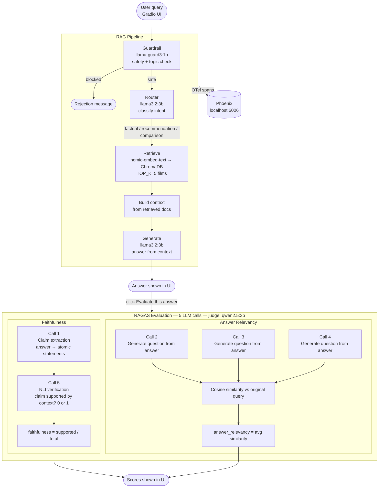

# CineRAG - Film Chatbot

A fully local RAG chatbot for film recommendations built with Ollama, ChromaDB, Phoenix and RAGAS.

---

## Full pipeline — from client to RAGAS



---

## Requirements

- Python 3.11+
- [Ollama](https://ollama.com) installed and running

---

## Setup

### 1. Enter the project folder

```bash
cd cinerag-film-chatbot
```

### 2. Create and activate the virtual environment

```bash
python -m venv .venv
source .venv/bin/activate
```

### 3. Install dependencies

```bash
pip install -r requirements.txt
```

> Note: use `arize-phoenix==4.29.0` — newer versions (8.x) pull in pydantic-ai and hundreds of
> heavy dependencies. If you already installed a newer version, downgrade with:
> ```bash
> pip uninstall arize-phoenix arize-phoenix-evals arize-phoenix-client arize-phoenix-otel -y
> pip install "arize-phoenix==4.29.0"
> ```

### 4. Start Ollama

```bash
ollama serve &
```

### 5. Pull the Ollama models

Run each pull one at a time:

```bash
ollama pull nomic-embed-text   # embeddings for ChromaDB (~300MB) — pull this first
ollama pull llama3.2:3b        # main generation model (~2GB)
ollama pull llama-guard3:1b    # safety guardrail (~1GB)
ollama pull qwen2.5:3b         # RAGAS judge model (~2GB)
```

Total download: ~5.5GB

### 6. Index the dataset into ChromaDB

The TMDB dataset is already included in `data/`. Run:

```bash
python ingest.py
```

This embeds 4799 films with `nomic-embed-text` and stores them in ChromaDB.
Runs in ~3-4 minutes. Progress bar shows status.

Actual output:
```
Loading dataset...
  4799 films loaded.

Indexing films: 100%|████████████| 4799/4799 [03:21<00:00, 23.81film/s]

Done. 4799 films stored in ChromaDB at './chroma_db'.
```

### 7. Verify ChromaDB

```bash
python -c "
import chromadb, ollama
from config import CHROMA_PATH, CHROMA_COLLECTION, EMBED_MODEL

client = chromadb.PersistentClient(path=CHROMA_PATH)
col = client.get_collection(CHROMA_COLLECTION)
print(f'Total films in ChromaDB: {col.count()}')

query = 'a mind-bending sci-fi film about dreams'
vec = ollama.embeddings(model=EMBED_MODEL, prompt=query)['embedding']
results = col.query(query_embeddings=[vec], n_results=3)
for meta in results['metadatas'][0]:
    print(f\"{meta['title']} ({meta['year']})\")
"
```

Expected output: 3 relevant films returned for the query.

---

## Run the mock chatbot

```bash
source .venv/bin/activate
python mock_chatbot.py
```

Open the browser at: `http://127.0.0.1:7860`

---

## Run the real chatbot (after completing all steps)

```bash
source .venv/bin/activate
python chatbot.py
```

---

## Observability (Phoenix via Docker)

Phoenix runs as a Docker container — no Python dependency conflicts.

### 1. Start Phoenix

```bash
docker run -p 6006:6006 -p 4317:4317 arizephoenix/phoenix:latest
```

Make sure Docker Desktop is running first.

### 2. Install the gRPC exporter

```bash
source .venv/bin/activate
pip install opentelemetry-exporter-otlp-proto-grpc
```

### 3. Start the chatbot

```bash
python chatbot.py
```

### 4. Open the dashboards

- Phoenix projects: `http://localhost:6006/projects`
- Traces for CineRAG: `http://localhost:6006/projects` → click **cinerag**

Traces are sent via gRPC to `localhost:4317` and appear in Phoenix after each query.

---

## Project structure

```
cinerag/
├── config.py          # model names, paths, constants
├── guardrail.py       # Llama Guard 3 safety + topic filter
├── classifier.py      # keyword router (informativa / raccomandazione / confronto)
├── responses.py       # mock answer data
├── pipeline.py        # respond generator + log builder
├── ui.py              # Gradio layout
├── mock_chatbot.py    # entry point for the mock version
│
├── ingest.py          # [Step 2] load TMDB dataset + index into ChromaDB
├── router.py          # [Step 4] LLM-based query router
├── rag_pipeline.py    # [Step 5] full RAG pipeline
├── chatbot.py         # [Step 7] real Gradio UI with streaming
├── evaluate.py        # [Step 8] RAGAS evaluation
│
├── data/
│   ├── tmdb_5000_movies.csv
│   └── tmdb_5000_credits.csv
│
├── chroma_db/         # created automatically by ingest.py
├── requirements.txt
└── README.md
```

---

## Build steps

| Step | File | Status | Description |
|------|------|--------|-------------|
| 1 | `requirements.txt` | done | Install dependencies and pull Ollama models |
| 2 | `ingest.py` | done | Clean TMDB dataset, embed with nomic-embed-text, store in ChromaDB |
| 3 | — | done | Verify ChromaDB (4799 films indexed, semantic search working) |
| 4 | `router.py` + `guardrail.py` | done | Llama Guard 3 safety check + LLM intent classifier |
| 5 | `rag_pipeline.py` | done | Full RAG: retrieve from ChromaDB, generate with llama3.2:3b |
| 6 | — | todo | Integrate Phoenix tracing (OpenTelemetry) |
| 7 | `chatbot.py` | todo | Real Gradio UI replacing the mock |
| 8 | `evaluate.py` | todo | RAGAS evaluation using qwen2.5:3b as judge |
| 9 | — | todo | Hallucination demo: without RAG vs with RAG |

---

## Models used

| Model | Role | Size |
|-------|------|------|
| `llama3.2:3b` | Answer generation | ~2GB |
| `nomic-embed-text` | Document + query embeddings | ~300MB |
| `qwen2.5:3b` | RAGAS judge (avoids self-eval bias) | ~2GB |
| `llama-guard3:1b` | Safety guardrail | ~1GB |

---

## Dataset

TMDB 5000 movies dataset — included in `data/` folder, no Kaggle account needed.

Source: https://www.kaggle.com/datasets/tmdb/tmdb-movie-metadata
