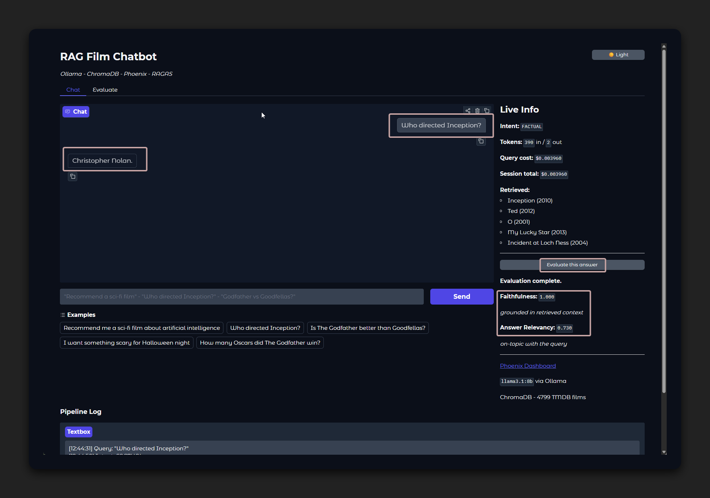
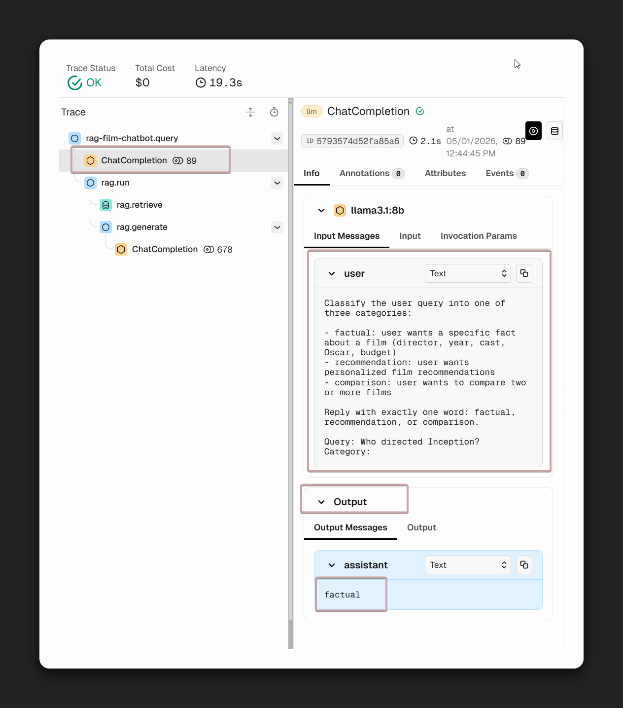
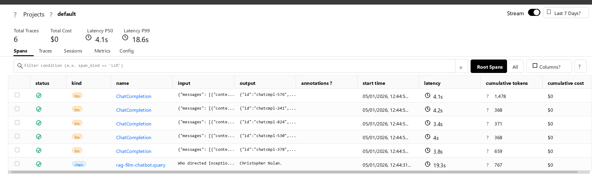

# RAG Film Chatbot

A fully local RAG chatbot for film recommendations built with Ollama, ChromaDB, Phoenix, and RAGAS.

## Full pipeline — from client to RAGAS


## Requirements

- Python 3.11+
- Ollama installed and running
- Docker Desktop, if you want Phoenix tracing

> 🪟 **Windows only:** use **Python 3.11** (not 3.12/3.13). `chromadb` ships pre-built wheels only for 3.11 on Windows — newer versions will fail to install with a C++ compiler error.

## Setup

### 1. Enter the project folder

```bash
cd local-rag-film-chatbot
```

### 2. Create and activate a virtual environment

🐧 **Linux / macOS**
```bash
python3 -m venv .venv
source .venv/bin/activate
```

🪟 **Windows (PowerShell)**
```powershell
python -m venv .venv
.venv\Scripts\Activate.ps1
```

> If PowerShell blocks the script with an execution-policy error, run once:
> `Set-ExecutionPolicy -ExecutionPolicy RemoteSigned -Scope CurrentUser`

🪟 **Windows (Command Prompt)**
```cmd
python -m venv .venv
.venv\Scripts\activate.bat
```

### 3. Install dependencies

🐧 **Linux / macOS**
```bash
.venv/bin/python -m pip install -r requirements.txt
```

🪟 **Windows**
```powershell
.venv\Scripts\python -m pip install -r requirements.txt
```

### 4. Start Ollama

```bash
ollama serve
```

### 5. Pull the Ollama models

```bash
ollama pull nomic-embed-text
ollama pull llama3.2:3b
ollama pull llama-guard3:1b
ollama pull qwen2.5:3b
```

### 6. Index the dataset into ChromaDB (one-time only)

The TMDB dataset is already included in `data/`. Skip this step if `chroma_db/` already exists.

🐧 **Linux / macOS**
```bash
.venv/bin/python ingest.py
```

🪟 **Windows**
```powershell
.venv\Scripts\python ingest.py
```

### 7. Run the chatbot

🐧 **Linux / macOS**
```bash
.venv/bin/python chatbot.py
```

🪟 **Windows**
```powershell
.venv\Scripts\python chatbot.py
```

Open `http://127.0.0.1:7860`.

## Observability with Phoenix

Phoenix runs in Docker and receives OpenTelemetry traces from the app.

### 1. Start Phoenix

```bash
docker run -p 6006:6006 -p 4317:4317 arizephoenix/phoenix:latest
```

### 2. Start the chatbot

```bash
.venv/bin/python chatbot.py
```

### 3. Open Phoenix

- Projects: `http://localhost:6006/projects`
- Traces appear under the `cinerag` project after each query

## Project structure

```text
local-rag-film-chatbot/
├── chatbot.py              # entry point — runs src/chatbot.py
├── ingest.py               # entry point — runs src/ingest.py
├── evaluate.py             # entry point — runs src/evaluate.py
├── requirements.txt
├── pytest.ini
├── .gitignore
│
├── data/
│   ├── tmdb_5000_movies.csv
│   └── tmdb_5000_credits.csv
│
├── images/                 # screenshots used in this README
│
├── scripts/
│   └── run-tests.sh
│
├── src/
│   ├── config.py           # model names, paths, env vars
│   ├── tracing.py          # OpenTelemetry + Phoenix init
│   ├── guardrail.py        # Llama Guard 3 safety + topic filter
│   ├── router.py           # LLM-based intent classifier
│   ├── rag_pipeline.py     # retrieve + generate pipeline
│   ├── evaluate.py         # RAGAS evaluation logic
│   └── chatbot.py          # Gradio UI (chat + evaluate tabs)
│
└── tests/
    ├── test_config.py
    ├── test_rag_pipeline.py
    └── test_router.py
```

## Environment variables

All values have defaults in `src/config.py` and can be overridden before running.

🐧 **Linux / macOS**
```bash
export OLLAMA_BASE_URL=http://localhost:11434
export GUARDRAIL_ENABLED=true
export LLM_MODEL=llama3.2:3b
export EMBED_MODEL=nomic-embed-text
export JUDGE_MODEL=qwen2.5:3b
export GUARD_MODEL=llama-guard3:1b
export CHROMA_PATH=./chroma_db
export CHROMA_COLLECTION=films
export TOP_K=5
```

🪟 **Windows (PowerShell)**
```powershell
$env:OLLAMA_BASE_URL="http://localhost:11434"
$env:GUARDRAIL_ENABLED="true"
$env:LLM_MODEL="llama3.2:3b"
$env:EMBED_MODEL="nomic-embed-text"
$env:JUDGE_MODEL="qwen2.5:3b"
$env:GUARD_MODEL="llama-guard3:1b"
$env:CHROMA_PATH="./chroma_db"
$env:CHROMA_COLLECTION="films"
$env:TOP_K="5"
```

---

## Answer, inference and RAGAS evaluation

### 1. Answer



The `Answer` is the final response returned to the user in the chatbot UI.
It is produced after the RAG pipeline has accepted the question, retrieved the
most relevant film documents from ChromaDB, built the context, and asked the LLM
to generate a grounded answer from that context.

### 2. Inference trace



Phoenix records the inference flow as a trace. A typical query starts from
`cinerag.query`, then enters the RAG pipeline through `rag.run`.
Inside that run, the application retrieves context with `rag.retrieve` and
then generates the final answer with `rag.generate`.

- `cinerag.query`: the parent trace for the whole user request
- first `ChatCompletion`: the router/classifier LLM call — classifies intent as `factual`, `recommendation`, or `comparison`
- `rag.run`: the main RAG pipeline container
- `rag.retrieve`: searches ChromaDB for the most relevant film documents
- `rag.generate` + nested `ChatCompletion`: builds the prompt from question + context, then calls the LLM

### 3. LLM calls breakdown



Clicking **Evaluate this answer** triggers RAGAS, which uses a judge model (`qwen2.5:3b`) to score the answer quality. RAGAS produces **5 LLM calls in total**:

```
faithfulness      → 2 calls
answer relevancy  → 3 calls
──────────────────────────────
1 evaluated sample → 5 calls   (N samples → 5×N calls)
```

**Faithfulness — did the chatbot stick to what it retrieved?**

- **Call 1**: extracts verifiable claims from the answer
- **Call 5**: checks each claim against the retrieved documents — `verdict: 1` if supported, `0` if not

**Answer Relevancy — did the chatbot actually answer the question?**

RAGAS generates 3 synthetic questions from the answer, then measures cosine similarity with the original question. Three attempts give a more stable average.

For the query `"Who directed Inception?"` → answer `"Christopher Nolan."`:

| Call | Judge generated question | Cosine similarity |
|------|--------------------------|-------------------|
| 2 | `"Who is Christopher Nolan?"` | ~0.70 — right person, wrong angle |
| 3 | `"Who directed the Dark Knight film series?"` | ~0.30 — wrong film entirely |
| 4 | `"Who is Christopher Nolan?"` | ~0.70 — same as Call 2 |

Average: (0.70 + 0.30 + 0.70) / 3 = **0.571**

The root cause: the answer `"Christopher Nolan."` is too short and does not mention `"Inception"`. The judge cannot infer which film is being discussed and goes off-topic on Call 3, pulling the final score below 1.0. A longer answer like `"Inception was directed by Christopher Nolan."` would score higher because the film title anchors the generated questions.

### 4. Evaluation flow

```text
Question → RAG inference → Answer → RAGAS evaluation → Scores
```

Evaluation happens **after** inference. The answer is already generated; only then the user can run evaluation on it.

---

## RAGAS metrics

### Faithfulness

Checks whether the generated answer is supported by the retrieved context. A low score means the model added facts not present in the retrieved documents — a hallucination risk.

- **Good:** the answer says only things that appear in the retrieved film data
- **Bad:** the answer invents a director, year, actor, or plot detail that was not retrieved

### Answer Relevancy

Checks whether the generated answer actually responds to the user question. A low score means the answer is generic, partial, or off-topic.

- **Good:** the user asks for a noir recommendation and the answer recommends noir films with a reason
- **Bad:** the user asks for a comparison and the answer only gives a generic movie summary
